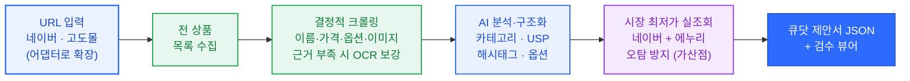
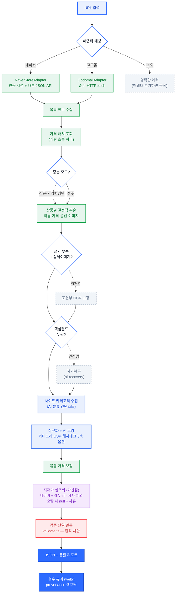

# 큐닷 AX 과제 — 브랜드 스토어 → 큐닷 상품제안서 자동 정규화

> **브랜드몰 URL 하나로 전 상품을 견고하게 크롤링하고, AI로 분석해 큐닷 상품업로드 양식으로 자동 정규화하는 도구.**

네이버 스마트스토어·브랜드스토어와 비(非)네이버 공식몰(고도몰)을 지원하며, **다른 링크를 넣어도 동작**하도록 어댑터 패턴으로 설계했습니다.

## 🔗 라이브 데모

**배포 주소 → https://quedot-assignment.vercel.app/**

- **`/demo`** — URL 입력 → 크롤 → AI 분석 → 정규화 파이프라인을 단계별로 시연합니다. 배포본은 실제 실행 기록(run-log)을 **재생**하고, 로컬(`npm run dev`)에선 실제 **라이브 크롤**이 돕니다.
- **`/store/kefii` · `/store/phytonutri` · `/store/happylandmall`** — 정규화 결과 검수 뷰어. 모든 필드의 **출처(provenance)**·채움률·품질 리포트를 확인할 수 있습니다.

> 실제 크롤은 로컬 인증 세션에서 실행되고, 배포 화면은 그 결과를 검수·전시합니다(Vercel엔 API 키·세션을 두지 않습니다).

## 이 도구가 푸는 문제

큐닷 운영팀이 새 브랜드를 온보딩할 때, 공식몰·스마트스토어를 보며 **상품제안서를 수백 줄 손으로 입력**하고 판매를 위해 **각 상품의 전사(全社) 최저가를 수기로 조사**합니다. 상품 수백 개 브랜드면 매번 수 시간이 들고, 옮겨 적다 가격·옵션 오타가 반복됩니다.
이 도구는 그 두 작업 — **제안서 정규화 + 최저가 조사** — 를 URL 하나로 자동화합니다.

## 무엇을 하는가

URL을 넣으면 그 몰의 전 상품을 순회 수집하고, AI로 분석·구조화해 큐닷 상품제안서(JSON)로 정규화합니다.



<details>
<summary><b>자세한 동작 흐름 보기</b> (조건부 분기 · 검증 관문 포함)</summary>



</details>

---

## 1. 실행 방법

### 설치

```bash
npm install
npx playwright install chromium   # 네이버 크롤용 (고도몰만 쓰면 생략 가능)
cp .env.example .env              # 아래 환경변수 채우기
```

### 환경변수 (`.env`)

| 변수 | 필수도 | 용도 | 없으면 |
|---|---|---|---|
| `OPENAI_API_KEY` | 권장 | AI 분석(카테고리·USP·해시태그·옵션) · OCR · 자가복구 | **룰 baseline으로 자동 강등** (동작은 함) |
| `NAVER_CLIENT_ID` / `NAVER_CLIENT_SECRET` | 선택(가산점) | `lowest_price` 네이버쇼핑 정확매칭 | 최저가는 에누리만 사용하거나 공란 |

> 키가 없어도 파이프라인은 멈추지 않습니다 — AI는 룰로 강등되고, 최저가는 사유와 함께 공란 처리됩니다.

### 크롤링 실행

```bash
# 사용법: npm run crawl <URL> <상품수(0=전수)> [ocr] [enuri] [incremental]

npm run crawl "https://brand.naver.com/kefii" 0 enuri     # 브랜드스토어 전수 + 최저가 실조회
npm run crawl "https://smartstore.naver.com/phytonutri" 0 # 스마트스토어 전수
npm run crawl "https://m.happylandmall.com/" 0 ocr        # 고도몰 전수 + 상세이미지 OCR
```

| 인자 | 의미 |
|---|---|
| `<URL>` | 스토어 URL (네이버 / 고도몰 — 어댑터 자동 선택) |
| `<상품수>` | 처리할 상품 수. **`0` = 전수** |
| `ocr` | 근거 부족 상품의 상세이미지 OCR 보강 (opt-in) |
| `enuri` | 에누리(쿠팡 포함) 최저가 비교 활성 (opt-in) |
| `incremental` | 이전 결과 대비 **신규·가격변경분만** 재크롤 |

- **네이버**: 최초 1회 브라우저 창에서 직접 로그인 → 이후 `naver-session/`에 세션 저장돼 재사용(캡차 없음).
- **결과물**: `output/{스토어}.json`(정규화 SKU) · `output/{스토어}.quality.json`(품질 리포트) · `output/{스토어}.cache.json`(증분용 가격 캐시).

### 검수 뷰어 (web/) — 정규화 결과를 출처 색코딩으로 검수

```bash
cd web
npm install
npm run dev        # predev 가 ../output 을 읽어 web/data 로 동기화 → http://localhost:3000
```

- 크롤 결과(`output/*.json`)를 읽는 **읽기 전용 Next.js 뷰어**. 별도 DB·서버·키 불필요.
- 배포: Vercel(Root Directory=`web`). 빌드 시 `../output`을 정적 생성(SSG)으로 굳혀 배포.

### 평가자용 — 키·세션 없이 동작 검증

```bash
npm run verify   # 합성 hard 케이스를 실제 코드로 통과: 자가복구·증분·환각차단·옵션 가드
npm test         # 단위 테스트: self-heal · incremental · option-guard
```

---

## 2. 기술 선택 이유

| 선택 | 제약 / 문제 | 그래서 이렇게 |
|---|---|---|
| **1. TypeScript** (`tsx`) | 큐닷 스택 친화 · 큐닷 제안서라는 **고정 스키마**를 안전하게 다뤄야 함 | 빌드 단계 없이 실행(`tsx`), 스키마를 **타입으로 강제**해 매핑 단계에서 형식 오류를 컴파일 타임에 차단 |
| **2. 크롤링: Playwright + stealth** | 네이버가 `curl`·기본 Playwright를 **429·캡차로 차단**, 화면 셀렉터 파싱은 구조 변경에 취약 | Playwright(+stealth)로 실제 브라우저처럼 접근하되, 파싱은 화면이 부르는 **내부 JSON API를 직접 호출**(결정적). 고도몰은 동적 렌더가 없어 **순수 HTTP fetch + cheerio**(브라우저 불필요) |
| **3. OCR: `sharp` + gpt-4o-mini 비전** | 고도몰 상세는 본문이 **통이미지**라 USP·옵션 텍스트 근거가 0. 통짜 OCR은 다운스케일로 환각(유아 사이즈 `80~110`→`S/M/L`) | `sharp`로 **세로 스트립 분할 후** 고해상도 비전 OCR → 결합. **근거 부족 상품에만** opt-in(네이버는 셀러태그 보유 → 스킵, 비용 0) |
| **4. 세션: 본인 로그인 세션 재사용** | 네이버 수집엔 로그인이 필요하고, 프록시·캡차솔버는 **계정·법적 리스크** | `launchPersistentContext`로 **최초 1회 직접 로그인** → `naver-session/`에 저장해 재사용. *"뚫는 기술"이 아니라 "리스크를 의식한 정공법"* (세션·키는 커밋 제외) |
| **5. AI: OpenAI gpt-4o-mini** (structured output) | "AI 출력을 신뢰하지 말 것" · 비용 | **룰 우선, LLM은 비정형 20%만**(카테고리·USP·해시태그·옵션 배치). `json_schema`로 출력 형식 강제 + category 7종 enum 제약. 분류·요약·비전 전부 **mini로 충분**(가성비), 실패 시 룰 fallback |
| **6. 어댑터 패턴** (`StoreAdapter`) | 몰마다 구조가 제각각이고, *"다른 링크를 넣어도 동작"* 요구 | 스토어별 수집기를 **인터페이스로 추상화** → **새 몰 = 어댑터 1개 추가**. `GodomallAdapter`는 도메인이 아니라 고도몰 **플랫폼 자체**를 감지해 다른 고도몰도 자동 동작 |
| **7. 검수 뷰어: Next.js + Vercel** | 결과(JSON)를 평가자가 **셋업 0으로** 검수하면 좋음. 데이터는 정적(수백 행)·이미지는 원본 CDN | 크롤 결과를 읽는 **읽기 전용 Next.js 뷰어**(SSG, Vercel 배포). **DB·서버 없이** JSON 번들로 충분 — *데이터 규모상 Supabase는 오버엔지니어링이라 의도적으로 배제* |
| **8. 최저가: 네이버쇼핑 OpenAPI(공식)** | 가산점 `lowest_price`엔 *시장 전체의 실제 최저가*가 필요. 쿠팡은 직접크롤(Akamai)·파트너스 API(심사) **둘 다 막힘** | **공식 OpenAPI**(`openapi.naver.com`, 키 발급·약관 동의)로 `syncNvMid` 정확매칭 → 가장 떳떳한 경로를 우선. 쿠팡 등 오픈마켓가는 **에누리(가격비교)로 우회** 보강 *(회고 4번)* |

### 합법성 · 매너

- **공식 API가 있으면 공식 API를 쓴다** — 최저가는 일부러 공식 네이버쇼핑 OpenAPI를 우선했습니다. 다만 *특정 스토어의 전 상품·옵션·재고*를 받는 공식 크롤링 API는 네이버에 **없어서**, 상품 수집은 브라우저 자동화가 불가피합니다.
- **매너 있는 크롤링** — 요청 간 딜레이(`rateLimitMs: 1500`) 유지, 동시 요청 자제, **본인 로그인 세션** 사용(프록시·캡차솔버 같은 우회 도구 ✕). 인증 세션·키는 커밋에서 제외.
- 공개 상품 정보의 자동 수집은 약관상 제한이 있을 수 있는 회색지대라, **상업적 재배포가 아닌 과제 목적**임을 전제로 위 원칙을 지켰습니다.

---

## 3. 회고

### 어떤 선택을 왜 했는지 · 고민 · 트레이드오프

#### 1. 네이버 봇 차단 — "뚫는 기술"보다 "안전한 정공법"

네이버는 프로그램의 자동 접속을 막아둬서, 평범하게 요청하면 곧바로 차단되거나 보안문자(캡차)가 뜹니다. 이걸 억지로 우회하는 도구(가짜 IP 돌리기, 보안문자 자동 풀기)도 있었지만 계정 정지·약관 위반 위험이 컸습니다.

→ 그래서 우회 대신, **사람이 한 번 직접 로그인해 둔 상태를 그대로 재사용**하는 방식을 골랐습니다.

> **트레이드오프** — 안전하고 차단도 안 당하는 대신, 맨 처음 한 번은 사람이 직접 로그인해줘야 합니다.

#### 2. 이미지 속 상품 설명 — OCR 활용

상품의 소구점(USP)은 상세페이지 설명에서 뽑는 게 가장 정확합니다. 그런데 설명이 글이 아니라 **이미지로 된 경우**가 많아 컴퓨터가 바로 읽을 글자가 없었습니다.

→ 그래서 **사진 속 글자를 읽어내는 OCR 기술**로 이미지에서 설명을 추출해 USP의 근거로 삼았습니다.

> **트레이드오프** — 설명 근거가 아예 없는 상품은 USP를 **억지로 지어내지 않고 비웠습니다**(지어내는 것보다 비우는 게 낫다는 원칙). 다만 글이 아닌 이미지라, OCR 정확도에 기대야 하는 한계는 남습니다.

#### 3. AI는 "기본값"이 아니라 "검증된 도구" — 믿지 않고 가둬서 썼다

과제는 *"AI로 분석하라"*와 *"AI 출력을 믿지 말라"*를 동시에 요구했습니다. 그래서 AI를 **꼭 필요한 데만, 그것도 검증을 거쳐** 쓰도록 가뒀습니다.

- **분류는 사이트에게 물었다** — 카테고리를 키워드 규칙으로 맞추려니 하나 고치면 다른 게 틀어지는 끝없는 땜질이었습니다. 결국 **그 사이트의 카테고리 메뉴 자체를 읽어** AI에게 판단 근거로 줬더니 깔끔히 해결됐습니다("사이트가 답을 알고 있었다").
- **AI 출력은 검문소를 통과시켰다** — AI가 만든 값(카테고리·설명 등)은 곧바로 쓰지 않고, **하나의 검증 관문**을 반드시 거치게 했습니다(틀린 형식·근거 없는 설명·이상한 값은 여기서 차단).
- **AI는 안전망으로만** — 핵심 정보(이름·가격)가 비었을 때만 AI가 원본에서 복구하게 했고, 평소엔 호출하지 않습니다.

> **트레이드오프** — AI를 적게 쓰니 비용·오류는 줄지만, "AI가 알아서 다 해주는" 화려함은 포기했습니다. 대신 **결과를 믿을 수 있게** 됐습니다.

#### 4. 시장 최저가 — 막다른 길에서 찾은 우회로, 그리고 "내 가게를 최저가로 착각한" 버그

가산점 항목인 '시장 최저가'는 여러 쇼핑몰 중 가장 싼 값을 찾아야 합니다. 처음엔 "최저가라면 쿠팡"이라 보고 쿠팡을 노렸지만 — 직접 접근은 강력한 차단에 막히고, 공식 제휴 API는 사업자 심사가 필요해 **둘 다 막다른 길**이었습니다.

→ 쿠팡을 직접 건드리는 대신, **여러 쇼핑몰 가격을 한곳에 모아 보여주는 가격비교 사이트(에누리)와 네이버쇼핑 공식 검색**을 함께 쓰는 우회로를 택했습니다.

- **고민한 핵심** — 가장 어려운 건 "이게 정말 같은 상품인가?"였습니다. '여행용 세트'나 '1+1 묶음'을 같은 상품으로 착각하면 엉뚱한 최저가가 들어갑니다. 그래서 확실한 신호(상품 고유번호·모델코드)가 맞으면 채택하고, 애매하면 **AI에게 "같은 상품인지" 판정**시켰습니다. 그래도 확신이 없으면 **틀린 값을 넣느니 비웠습니다.**
- **실데이터로 잡은 결정적 버그** — 완성했다고 생각한 뒤 실제 결과를 눈으로 보다가, **자기 가게(브랜드 자사몰)를 '최저가'로 잡는** 버그를 발견했습니다. 최저가는 "우리 말고 다른 데서 더 싼 곳"이어야 하는데, 정확매칭이 자사몰을 1순위로 끌어와 의미가 없어진 것이죠. → **자사몰은 후보에서 제외**하도록 바로잡았습니다.

> **트레이드오프** — 오탐을 피하려 보수적으로 가니 최저가를 못 채운 상품도 생깁니다. 하지만 명세가 *"오탐 방지가 핵심"*이라 못 박은 만큼, **틀린 값보다 빈칸**을 택했습니다.

#### 5. 속도 vs 안전 — "빨리 긁기" 대신 "적게 호출하기"

상품이 수십~수백 개라 하나씩 다 열어보면 느립니다. 빨리 끝내려면 요청 사이 간격을 줄이면 되지만, 그러면 **너무 잦은 접속으로 차단당할 위험**이 커집니다.

→ 간격을 줄이는 대신, **요청 횟수 자체를 줄이는** 쪽으로 속도를 확보했습니다. 목록에서 한 번에 얻는 정보는 상품마다 다시 묻지 않고, 가격도 여러 상품을 **한 번에 묶어** 조회했습니다.

> **트레이드오프** — 접속 간격(매너)은 그대로 지키니 전수 수집엔 시간이 걸리지만, **차단 위험 없이 안정적으로** 전 상품을 모읍니다. 속도를 위해 안전을 깎지 않았습니다.

---

### 새로 알게 된 점

- **"검증했다"는 말 자체가 검증 대상이다.** 중요한 버그(자기 가게를 최저가로 착각한 것 등)는 **실제 결과를 눈으로 보다가** 나왔습니다.
- **AI는 적게 쓸수록 믿을 수 있다.** "AI가 알아서 다 해준다"보다, 꼭 필요한 20%에만 검증을 거쳐 쓰니 오히려 결과를 신뢰하게 됐습니다.

### 시간·여건이 더 있었다면 시도할 것

- **가격비교 소스 다양화** — 지금은 에누리·네이버 2곳입니다. 다나와 등 여러 곳으로 교차검증하면 최저가 신뢰도가 올라갑니다(특히 의류처럼 가격비교가 약한 카테고리).
- **OCR 속도·정확도 개선** — 이미지에서 설명을 읽어내는 작업이 느리고 정확도에 한계가 있습니다.
- **새 쇼핑몰 수집 어댑터 추가** — 지금은 네이버·고도몰 2종을 지원합니다. 무신사·자사몰 솔루션 등 다른 플랫폼도 어댑터를 추가해 직접 수집하고 싶습니다.

### 실제 서비스로 확장한다면 고려할 포인트

- **공식 API·제휴 우선** — 본인 로그인 세션 재사용은 과제 규모엔 적절하지만, 여러 스토어를 상시 수집하는 서비스라면 정식 파트너십·공식 API가 맞습니다.
- **어댑터 자동 생성** — 지금은 새 쇼핑몰을 지원하려면 사람이 그 사이트에 맞는 어댑터를 직접 만들어야 합니다. 사이트 구조를 분석해 **어댑터를 자동으로 생성**하면, URL만 넣으면 어떤 몰이든 수집하는 데 한발 더 가까워집니다.

---

## 4. 샘플 출력 (대상 스토어 3곳)

출력 1건은 **옵션 조합(SKU) 단위**이며, 각 필드값과 함께 *어떻게 얻었는지*(`provenance`)를 기록합니다. 전체 결과는 [`output/`](./output) 디렉터리(`{스토어}.json` + `{스토어}.quality.json`)에 있습니다.

### ① phytonutri (네이버 스마트스토어) — provenance까지 전체

```jsonc
{
  "data": {
    "brand_name": "파이토뉴트리",
    "name": "지니어스뉴 DHA ALA 영양 제품 올로메가 베이비 스마트 이유식 부스터 드롭스",
    "image_url": "https://shop-phinf.pstatic.net/.../68940007644304227_1216296138.jpg",
    "option1": "지니어스뉴 드롭스 1개 / 오프너O",
    "option2": null,
    "consumer_price": 46000,
    "sales_price": 26800,
    "lowest_price": 26800,
    "discount_rate": 41.7,
    "hashtags": ["DHA", "영양제", "이유식"],
    "usp": "두뇌 발달을 위한 오메가3 성분이 포함된 제품입니다.",
    "category_group": ["유아 건강"]
  },
  "provenance": {
    "brand_name":     { "method": "deterministic" },
    "name":           { "method": "deterministic" },
    "image_url":      { "method": "deterministic" },
    "option1":        { "method": "deterministic", "source": "옵션 정규화(룰: 위치 기반·수식어 제거)" },
    "option2":        { "method": "empty", "reason": "단일 옵션 축" },
    "consumer_price": { "method": "deterministic" },
    "sales_price":    { "method": "deterministic" },
    "discount_rate":  { "method": "calculated" },
    "lowest_price":   { "method": "crawled", "source": "네이버쇼핑 · pid==mid", "fetchedAt": "2026-06-12T19:31:..." },
    "hashtags":       { "method": "ai", "source": "sellerTags+상품명 / openai" },
    "usp":            { "method": "ai", "source": "상품명+태그 / openai" },
    "category_group": { "method": "ai", "source": "카테고리경로+스토어카테고리 / openai" }
  },
  "meta": { "productNo": "9623766251", "naverMid": 87168268521, "basis": { "categoryPath": true, "usp": true } }
}
```

### ② kefii (네이버 브랜드스토어) — 2축 옵션(색상 조합)

```jsonc
{
  "data": {
    "brand_name": "케피",
    "name": "케피 버블클렌저 3개 핑크+옐로우+퍼플 아기 거품목욕 버블스프레이 유아바스",
    "image_url": "https://shop-phinf.pstatic.net/.../51094225557261089_1625051651.jpg",
    "option1": "버블클렌저 200ml 3개",
    "option2": "핑크+옐로우+퍼플",
    "consumer_price": 32700, "sales_price": 18300, "lowest_price": 18300, "discount_rate": 44,
    "hashtags": ["버블클렌저", "유아거품목욕", "아기바디워시", "..."],
    "usp": "아기 거품목욕을 위한 버블클렌저 3개 세트.",
    "category_group": ["유아 놀이 교육", "유아 생활"]
  }
  // provenance: option1/2 = deterministic, lowest_price = crawled(네이버), hashtags/usp/category = ai
}
```

### ③ happylandmall (고도몰 공식몰) — 색상×사이즈, 에누리 최저가, OCR 근거 USP

```jsonc
{
  "data": {
    "brand_name": "해피랜드",
    "name": "[해피랜드] 코벤트 민소 상하 H1321210",
    "image_url": "https://godomall-storage.cdn-nhncommerce.com/.../1000000641_main_04.jpg",
    "option1": "노랑", "option2": "100",
    "consumer_price": 28000, "sales_price": 28000, "lowest_price": 23520, "discount_rate": 0,
    "hashtags": ["코번트민소", "상하복", "스트라이프", "..."],
    "usp": "청량한 색감의 스트라이프 패턴과 동물 그래픽이 포인트인 민소매 상하복입니다.",
    "category_group": ["유아 생활"]
  }
  // provenance: lowest_price = crawled(에누리·마리오아울렛), usp = ai(상세이미지OCR) ← 상세가 이미지라 OCR로 근거 확보
}
```

> **검수 뷰어(배포)**: *(배포 후 URL 추가 예정)* — 전 상품을 출처 색코딩으로 검수.

---

## 5. 필드별 처리 설명

### 각 필드를 어떻게 채웠는지

색 구분: 🟢 **결정적/계산**(코드로 원본 추출) · 🔵 **AI**(비정형, LLM) · 🟣 **외부 실조회**

| 필드 | 처리 | 방법 |
|---|---|---|
| `brand_name` `name` `image_url` | 🟢 결정적 | 내부 JSON API / 목록 카드에서 원본 그대로 |
| `consumer_price` `sales_price` | 🟢 결정적 | 가격 API(네이버 `product-benefits` 배치) · 옵션 추가금은 합산 |
| `discount_rate` | 🟢 계산 | `(정가 − 판매가) / 정가` 로 코드 계산 |
| `option1` `option2` | 🟢 결정적(룰) | 위치 기반 + 수식어·이모지 제거. **3축일 때만** AI가 2칸으로 배치 |
| `lowest_price` | 🟣 외부 실조회 | 네이버쇼핑 OpenAPI + 에누리, **자사몰 제외**, 오탐 시 공란 |
| `hashtags` | 🔵 AI | 셀러태그 + 상품명 근거로 LLM 추출 |
| `usp` | 🔵 AI | 상품명·태그·(이미지면 OCR) 근거로 LLM 생성 |
| `category_group` | 🔵 AI | 사이트 카테고리 메뉴 + 상품을 LLM이 7종으로 분류 |

> `method`는 실제 경로와 일치하게 정직 표기합니다(예: 단일 축 옵션은 `deterministic`, 추출 실패를 LLM이 복구하면 `ai-recovery`).

### AI로 분석·분류한 필드 (명확히 구분)

**`hashtags` · `usp` · `category_group`**, 그리고 **3축일 때의 옵션 배치**만 AI를 씁니다. 나머지(이름·가격·이미지·옵션 값)는 전부 코드로 결정적 처리합니다.
**AI 출력은 모두 검증 관문(`validate.ts`)을 통과**해야 산출물에 들어갑니다 — 7종 밖 카테고리 제거·근거 없는 USP 무효화·이상 가격 차단.

### 못 채운 필드 — 어떻게 시도했고 왜 못 채웠나 (지어내지 않음)

| 필드 | 시도 → 공란 사유 |
|---|---|
| `lowest_price` | 네이버·에누리 2소스 조회했으나 **시장에 동일 구성이 없음**(브랜드 독점·복합세트) → 억지 매칭 대신 `null` |
| `usp` | 상품명·태그·OCR까지 동원했으나 **근거 0** → `validate`가 환각으로 차단하고 비움 |
| `consumer_price` `sales_price` | 가격 API 응답이 없는 일부 항목은 추측 없이 공란 |
| `option2` | 옵션 축이 하나뿐인 상품은 `option2`가 본질적으로 없음 |

> **자가복구(self-heal)**: 결정적 추출이 핵심 필드(이름·정가)를 비우면 원본을 LLM이 복구하되 **원본에 실재하는 값만**(grounded) → `ai-recovery`로 표기. 평소엔 호출 0인 안전망입니다.

---

## 부록 A. 설계 원칙 · 아키텍처

### 핵심 설계 원칙

- **결정적 추출** — 내부 JSON API/구조화 데이터에서. 화면 셀렉터는 최후 수단.
- **룰 우선, LLM은 어려운 20%만** — 정형은 코드, 비정형 분류·요약만 LLM.
- **AI 출력을 신뢰하지 않는다** — 모든 LLM 출력은 `validate.ts` 단일 관문 통과.
- **지어내지 않는다** — 못 얻는 값은 공란(null) + 사유. 추측 금지.
- **크롤링 매너** — 딜레이 유지, 인증은 본인 세션 재사용.

### 아키텍처

```
URL → [crawler] 통신 → [adapters] 스토어별 수집 → [normalize] 매핑·검증 → [ai] 분류·요약 → JSON
                       단방향 의존 · 상품 단위 에러 격리(1개 실패해도 계속)
```

- **어댑터 패턴**: 스토어별 수집기는 `StoreAdapter` 구현 → **새 몰 = 어댑터 1개.**
- **AI 추상화(`Enricher`)**: 룰/OpenAI 교체 가능, 키 없으면 룰 baseline 자동 강등.
- **환각 차단 단일 관문(`validate.ts`)**: provider 경로 무관하게 최종 산출물 필수 통과.

| 스토어 | 어댑터 | 방식 |
|---|---|---|
| 네이버 스마트·브랜드스토어 | `NaverStoreAdapter` (prefix 차이만) | 인증 세션 + 내부 JSON API |
| 고도몰 공식몰 (happyland 등) | `GodomallAdapter` | 순수 HTTP fetch + cheerio (브라우저 ✕) |
| 그 외 미지원 | — | 런타임 검증 후 **명확한 에러로 graceful 실패** |

> `GodomallAdapter`는 도메인이 아니라 **고도몰 플랫폼 자체**를 감지 → 다른 고도몰도 자동 동작.

---

## 부록 B. AI 활용 상세

**룰 우선 + 환각 차단** — LLM은 category/usp/hashtags/옵션만. structured output(json_schema)로 출력 강제, category는 7종 enum 제약. 실패 시 룰 fallback. 모든 출력은 `validate.ts` 통과(7종 밖 제거·근거 없는 USP 무효화·가격 이상 차단).

<details>
<summary><b>🔍 조건부 OCR — 근거 부족 상품 보강</b></summary>

고도몰 상세는 본문이 이미지라 텍스트 근거가 빈약. `셀러태그·본문 없음`일 때만 상세 composite(`_DC`)를 **세로 스트립 분할 → gpt-4o-mini 비전 → 결합**(통짜 OCR은 다운스케일 환각: 유아 사이즈 `80~110`→`S/M/L`). 네이버는 셀러태그 보유 → 스킵(비용 0). `npm run crawl <url> <n> ocr`
</details>

<details>
<summary><b>💰 lowest_price — "우리 외 타몰의 최저가" (자사몰 제외 · 오탐 방지)</b></summary>

정의: lowest_price = *우리 판매가 말고 다른 곳에서 더 싸게 파나*. 그래서 **자사몰은 후보에서 제외**(자사 가격은 이미 `sales_price`).

- **2소스**: 네이버쇼핑 OpenAPI(`syncNvMid` 정확매칭) + 에누리(쿠팡 포함 가격비교) → 더 낮은 값.
- **자사 제외**: `pid==mid`(자사 카탈로그)·네이버 스토어 링크 = 자사 → 타몰만 본다.
- **오탐 차단**: 가격 sanity·브랜드·토큰·수량/묶음 가드 → 모델코드 일치는 확정, 나머지는 **LLM이 동일상품 검수**(복합세트 구성 차이까지). 통과 없으면 `null + 사유`.
- **출처 기록**: `mall`(옥션·G마켓…)·`fetchedAt`·매칭 경로를 정직 표기. 옵션별 판매가 다르면 SKU별 적용.

`npm run crawl <url> <n> enuri`
</details>
